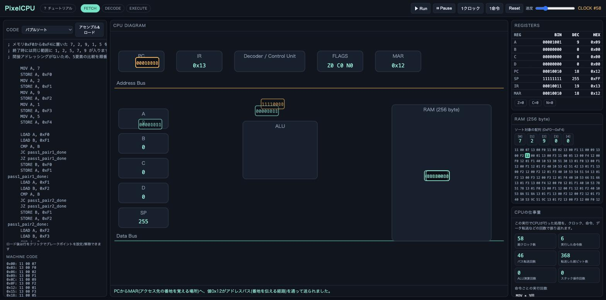

# PixelCPU

**公開URL: https://pixelcpu.vercel.app**

PixelCPUは、8bit CPUの中でデータが動く様子を、1クロックずつ目で追えるブラウザ上のCPUエミュレータです。アセンブリを書くと、命令の実行位置、レジスタやRAMの変化、バスを流れる値、ALUの計算が連動して表示されます。

CPUに初めて触れる人が、命令の結果だけでなく「今、内部で何が起きたのか」を直感的に理解できることを目指しています。ZEN Study「動くWebページコンテスト」応募作品です。



## 特徴

- 1クロック＝1 micro-opで、フェッチ・デコード・実行を段階的に可視化
- Assembly、Machine Code、回路図をPCとIRに同期して表示
- バス上のデータ転送やALU演算をアニメーションで表現
- 各micro-opをCPU初心者向けの日本語で解説
- Run、Pause、1クロック実行、1命令実行、ブレークポイント、速度変更に対応
- レジスタA〜D、PC、SP、IR、フラグ、256byte RAMの状態を確認可能
- クリックでブレークポイントを設定でき、Runで指定した命令の直前に自動停止
- クロック数・命令数・バス転送量・ALU演算回数など「CPUの仕事量」を集計する統計パネル
- 実際のUI要素を光らせながら説明する視覚的なオンボーディング(ヘッダーの「？ チュートリアル」からいつでも再生可能)
- バブルソートやフィボナッチなど、メモリ上の配列を扱うサンプルは専用の配列ビューでわかりやすく表示
- フィボナッチ数列やバブルソートなど、6本のサンプルプログラムを収録

## ローカルで動かす

ビルドツールを使わない、素のHTML/CSS/JavaScriptです。Node.jsは開発用サーバーとテストの実行にのみ使います。

```sh
npm install
npm run dev
```

表示されたローカルURL(既定は http://localhost:5173/ )をブラウザで開いてください。`npm run dev`はビルドを行わず、`scripts/dev-server.js`という外部ライブラリに依存しない素朴な静的ファイルサーバーを起動するだけです。本番と同じファイルをそのまま配信します。

テストを実行する場合は次のコマンドを使います(テスト実行にのみVitestを使用しており、ページ自体には含まれません)。

```sh
npm test
```

## PixelCPUの仕様

PixelCPUは、プログラムとデータが同じRAMを共有するフォン・ノイマン型の小さなCPUです。

| 項目 | 内容 |
|---|---|
| データ幅 | 8bit |
| 汎用レジスタ | A、B、C、D |
| 専用レジスタ | PC、SP、IR、MAR |
| フラグ | Z（ゼロ）、C（キャリー）、N（負数） |
| RAM | 256byte |
| スタック | 0xFFから下方向へ成長 |

利用できる命令は次のとおりです。

```text
NOP HLT MOV LOAD STORE
ADD SUB INC DEC
AND OR XOR NOT CMP
JMP JZ JNZ JC
PUSH POP CALL RET
```

アセンブリでは、レジスタ名に`A`〜`D`、数値に10進数または`0x`から始まる16進数を使えます。

```asm
; 1から10までの合計をAに求める
    MOV A, 0
    MOV B, 10

loop:
    ADD A, B
    DEC B
    JNZ loop
    HLT
```

## サンプルプログラム

`src/samples/`には、次のプログラムを収録しています(`*.asm`は読みやすいリファレンス、実行時はビルド不要で読み込めるよう`index.js`内の文字列を使用。テストで内容が一致することを検証しています)。

1. 1から10までの合計
2. フィボナッチ数列
3. 足し算の繰り返しによる掛け算
4. メモリ範囲のコピー
5. CALL/RETを使ったサブルーチン
6. バブルソート

## 技術構成

- Vanilla JavaScript(ES Modules) / CSS / SVG のみ。ビルドステップなし
- 外部ライブラリ・フレームワークは一切不使用(Bootstrap/Tailwindも含め未使用)
- テスト実行にのみVitestを使用(ページには一切含まれません)

CPUコアはUIに依存しない状態機械として実装し、各クロックで発生したイベントを画面の描画と日本語解説へ渡します。外部のUIライブラリやアニメーションライブラリには依存せず、CPUの動きに合わせた表示をJavaScriptとSVGで構成しています。ページは`<script type="module">`によるネイティブのES Modulesで構成されており、バンドラーなしでそのまま動作します。

## ライセンス

[MIT License](./LICENSE)
